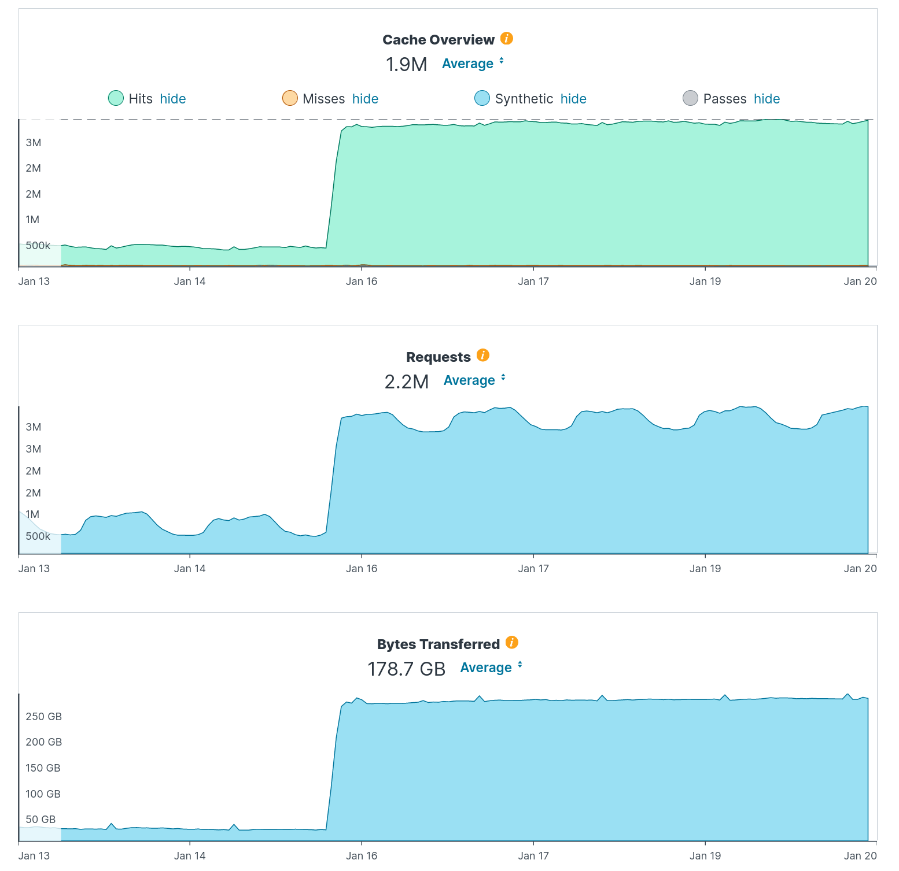

# Daniel's weekly report

# January 28, 2022

## Happened this week

- The
  [email](https://daniel.haxx.se/blog/2022/01/24/logj4-security-inquiry-response-required/)
  I received, tweeted about and finally blogged about got some serious
  attention which distracted me somewhat in the start of the week. I tried to
  get a conversation going with them but I seem to have failed. The company
  name behind my blacked out fields in the published emails is **MetLife**.

- The most likely never-ending troubles with host names ending with a trailing
  dot got another episode this week when I landed [a change in
  curl](https://github.com/curl/curl/pull/8320) that partly reverts a change
  done almost eight years ago which should make curl now handle these names
  more aligned with how current browsers use them. There is no doubt in my
  mind that we will have reasons to revisit this topic again in the future.
  Hopefully it will take another eight years before we do.

- I've written an initial version of [support for
  --json](https://github.com/curl/curl/pull/8314), and I think I'm going to
  land this for inclusion already in the next curl release. The
  [discussion](https://github.com/curl/curl/discussions/8312) is still going
  on for the more advanced functionality to actually create JSON, and I
  haven't yet decided on what I think about it or exactly how that is going to
  play out. I think we need more time to work on that and maybe write up a
  first attempt to let us try it out a little before we make up our minds,
  needing longer time than until the feature freeze next week. Feel free to
  jump in and share your views on this with us!
 
- Another [brain storming
  session](https://github.com/curl/curl/discussions/8335) was started with my
  asking for feedback about a new libcurl API for accessing response headers.
  It immediately showed that the easiest approach I had in mind probably was a
  little bit too easy and narrow-minded. I think maybe with some more thoughts
  and iterations this could lead to a good API that will save application
  authors' time and energy in the future.

- I did an online presentation for the Rust Linz meetup about "curl with
  rust". The [live-streamed version](https://youtu.be/yLGLKKFFc3g?t=4116) is
  available for watching, but I believe it will be made available in a more
  polished version later. I also made the [slides
  available](https://www.slideshare.net/bagder/curl-with-rust).

- I got really fed up with NSS this Friday morning when I realized they have
  completely removed their online API documentation, making me ask the
  question [Has the time come to drop
  NSS?](https://curl.se/mail/lib-2022-01/0120.html) (from being supported by
  curl) on the libcurl mailing list. They are clearly making it very hard for
  outsiders to use their library.
  
- Reminder: [get curl support](https://curl.se/support.html) for your company.
  This is what lets me work on curl this much.

## Blog posts

- [LogJ4 Security Inquiry – Response Required](https://daniel.haxx.se/blog/2022/01/24/logj4-security-inquiry-response-required/)

## Coming up

- curl roadmap 2022
- Working the header API proposal
- A presentation on "safe code" for a Swedish broadcasting company
- curl feature freeze
- closing in to the 1,000th curl commit author

## Feedback

[Comment here](https://github.com/bagder/log/discussions)

# January 21, 2022

## Happened this week

- It was pointed out to me that the look if this log is not very phone
  friendly, which disappointed me. It is just a default GitHub theme and I
  thought they assured that... I haven't changed theme yet since I don't know
  which are good if any, so I haven't decided on how to go forward with that.

- Feedback is tricky. Thursday afternoon my time I posted an [email to the
  curl-users](https://curl.se/mail/archive-2022-01/0043.html) mailing list and
  almost in parallel I [asked people on
  Twitter](https://twitter.com/bagder/status/1484158794246639617) the same
  question: Is it time to add some JSON aware support to the curl tool? It
  took off immediately on
  [hackernews](https://news.ycombinator.com/item?id=30011382) and
  [reddit](https://www.reddit.com/r/programming/comments/s8puao/curl_to_add_native_json_support/)
  and the apparently intense interest made me also create a separate [GitHub
  discussion](https://github.com/curl/curl/discussions/8312) for it. Then
  what? It smells of the good old bike shed problem: everyone can easily have
  an opinion on the matter. 1/3 are completely against the idea (layer
  violation, feature creep etc), 1/3 immediately pointed out numerous other
  things that apparently also **must** be supported for this to work and 1/3
  seemed to mostly agree but ... different tweaks. So yes, much more and
  thorough feedback than I am used to, but also so disparate and wide-ranging
  that it is really hard to maneuver through. My plan it to take it slowly,
  move forward with baby steps, go where I get the least amount of complaints
  and see where it takes us.

- On the [Security Now podcast episode
  853](https://twit.tv/shows/security-now/episodes/853) (starting about one
  hour in), the host Steve Gibson talks about last week's URL confusion
  vulnerability research paper

- A tsunami of web traffic on the curl site apparently started just before
  Jan 16. I have no idea what this is since I don't log anything. Fastly just
  deals with it for us right now, but if the pattern sticks going forward I
  will need to investigate. (The image below is from the Fastly control
  panel. The Y axis and the averages, are amounts per hour. The X axis is the
  last week.)

- I posted my blog post called [Enforcing the
  pyramid](https://daniel.haxx.se/blog/2022/01/17/enforcing-the-pyramid-of-open-source/)
  explaining a little why it is hard to fix the problem of low quality and
  occasional security issues appearing in small but widely used open source
  projects. I think often the real reasons for the problems are ignored and
  people mostly repeat "lack of funding". It might still be a lack of funding,
  but the problem is also *where* funding should go and *how* to manage that
  funding to actually enforce the software components others rely
  on. Everyone's good intention are unfortunately not going to change a lot I
  think, for pure economic reasons: companies make a lot of money this way.

- I discovered that curl still had source code left for Watcom compilers, even
  after we removed the support for building with this dead compiler well over
  a year ago so I went through and cleaned up. It made me realize that BeOS
  also had similar traces and I subsequently removed those as well. Less code
  is good. Especially when the removed code is never used anyway!  Inspired by
  having found leftovers for these two legacy systems I wrote up a script that
  collects and analyzes all defines used in `#if` and `#ifdef` lines in the
  product code in an effort to find more to clean off.  [The
  result](https://curl.se/mail/lib-2022-01/0048.html) shows that we use no
  less than 1,154 (!) different symbols in such lines, but I didn't find any
  more equally obvious targets to clean up...

## Blog posts

- [Enforcing the pyramid](https://daniel.haxx.se/blog/2022/01/17/enforcing-the-pyramid-of-open-source/)

## Coming up

- More curl roadmap 2022 thoughts
- More json thoughts and maybe code
- A header API proposal for libcurl
- I'll do an online presentation called [curl with
  rust](https://www.meetup.com/Rust-Linz/events/283116945/) for the Rust Linz
  Meetup on Thursday January 27th.

## Feedback

[Comment here](https://github.com/bagder/log/discussions)

# January 14, 2022

## Happened this week

- The curl [feature window](https://curl.se/dev/feature-window.html) is now
  open and we've started to merge outstanding pull-requests for new features.
  This also means that the next curl release is now going to be called
  **7.82.0**.

- The report on [URL parser
  confusion](https://security.claroty.com/URLparserconfusion) that I have I
  mentioned before went public on Monday. It discusses problems and
  inconsistencies among URL parsers that can lead to vulnerabilities. I also
  joined Snyk's [live stream](https://www.twitch.tv/videos/1260182192) and
  talked about the report and the topic. I also wrote a separate blog post
  about it, see below.

- Microsoft took a big step forward this week and shipped an upgrade to curl
  for Windows. They had stalled on version 7.55.1 for years and now they took
  a giant leap in one go straight up to **7.79.1**. Dustin Howett said they
  intend to [keep up-to-date
  better](https://twitter.com/DHowett/status/1481302347552862211) going
  forward.
  
- In Microsoft's [upgrade
  note](https://msrc.microsoft.com/update-guide/en-US/vulnerability/CVE-2021-22947),
  they specifically highlight that they've addressed
  [CVE-2021-22947](https://curl.se/docs/CVE-2021-22947.html) but they also
  confusingly call that problem a "Remote Code Execution Vulnerability" -
  which it isn't. After some back-channel talk, it has been explained that
  they fixed a whole range of problems with that upgrade and it includes one
  RCE. This seems reasonable, as we list quite a few [known vulnerabilities in
  7.55.1](https://curl.se/docs/vuln-7.55.1.html). **35** to be exact.

- At wolfSSL we have started the year by internally discussing **the curl 2022
  Roadmap** or more specifically what I will work on in curl this year. I took
  the subject to the mailing lists and I also got a lot of feedback on my
  Twitter question for [lessons from curl
  alternatives](https://twitter.com/bagder/status/1481186883560476674). We are
  going to customers starting next week and I will most likely do a webinar on
  the topic maybe early February.

- I did an internal curl presentation at [wolfSSL](https://www.wolfssl.com/)
  since we have quite a few new faces at the company over the last
  year. What's curl, what does it do, existing customers, how do we (want to)
  sell curl and something about the possible roadmap 2022. In the big wolfSSL
  family of libraries and products, curl is certainly the little brother
  business-wise. Room to grow.

- Our friends in the [quiche project](https://github.com/cloudflare/quiche)
  [landed a changed](https://github.com/cloudflare/quiche/pull/1122) that
  brought the `quiche_conn_peer_cert()` function that would allow us to verify
  the server certificate when doing QUIC connections (for HTTP/3) with this
  library. Ironically though, it still turned out inadequate for curl's
  purposes and we instead took [a different
  route](https://github.com/curl/curl/pull/8275) when Alessandro Ghedini
  stepped up and took us a lot closer to the goal. Without using that new
  function.

- Vaxxed v3.

## Blog posts

- [Don’t mix URL parsers](https://daniel.haxx.se/blog/2022/01/10/dont-mix-url-parsers/)

## Coming up

- More PR review and merging.
- A libssh2 release is due and it might happen this coming week
- curl roadmap 2022
- A blog post around [the OSS pyramid](https://twitter.com/bagder/status/1481938497728569345)

## Feedback

[Comment here](https://github.com/bagder/log/discussions)

# January 7, 2022

## Happened this week

- Because I had some time off during Xmas I didn't do any weekly report last
  week and therefore this edition might include stuff I did last week when I
  was supposed to not do much.
  
- On January 5 we released curl 7.81.0, and I got to be the release shepherd
  for the 205th curl release ever. There have been some issues reported on
  this version, in particular some annoying build related quirks, but so far
  none of them have been deemed serious enough to warrant any follow-up patch
  release. It looks like we can open the feature windows next week and plan
  for a 7.82.0 release for **March 2** - precisely according to the schedule.
  
- I have brought up the discussion about "curl roadmap 2022" on the mailing
  lists as well as [on
  Twitter](https://twitter.com/bagder/status/1479216791998058498) in order to
  listen in on what people are thinking about and want for curl these days. I
  hope to put together a 2022 roadmap that at least outlines what **I** plan to
  work on for curl this year. It is also intended to highlight the fact that
  paying customers/companies of mine can affect this. Get in touch!
  
- Almost every single downstream curl packager has its own set of custom
  patches applied. Many of those changes are just patches that affect
  particular details in the build and are not details we would like to modify
  in the project's upstream code. After I did a closer inspection of the
  patches used by Debian, FreeBSD and msys it is also clear that there are
  functional changes all over that the downstreams haven't submitted to us. In
  most cases they also ship and get applied without much explanations or
  documentation making it hard for us to do anything about them. I assume the
  patches *are* or *were* better motivated at some point.
  
- I have slowly started to move CI jobs away from Zuul CI over to other
  services. When Travis ["went
  rogue"](https://daniel.haxx.se/blog/2021/06/14/bye-bye-travis-ci/) last
  summer, we moved almost all of those CI jobs over to Zuul CI and we were
  happy having managed the shutdown in such an elegant and swift manner. At
  the most, we had 31 different CI jobs running on Zuul (out of the about 100
  jobs we run in total). Over time however, it has turned out that Zuul's
  integration with GitHub is so flawed and that builds frequently don't even
  show up in Zuul's UI that I have felt forced to decide that they are not a
  preferred service either. It's not any alarming problem but I plan to pick a
  few jobs every now and then and get them moved over to run on other services
  instead. Feel free to help me out with this.

- Let me tell you about my hack of the week to increase my productivity: I've
  now created a build script that replaces my alias (`b`) I've been using for
  building curl. The previous alias would do `make -C $HOME/src/curl -sj7`
  just as a convenient shortcut (it uses `-s7` only to make my video streaming
  performance get less affected when I do live-coding sessions). The
  replacement now has an additional tweak: it also scans *modified* files to
  verify that the copyright year ranges are correct. curl's copyright scan
  script is otherwise too slow to run against *all* files in every build
  command. The complete script looks like this:

~~~shell
#!/bin/sh
cd /home/daniel/src/curl
files=$(git diff origin/master --name-only)
if test -n "$files"; then
    ./scripts/copyright.pl $files
    res=$?
    if test $res != 0; then
        exit 2
    fi
fi

make -sj7
~~~

## Blog posts

- [curl 7.81.0 – more
  percent](https://daniel.haxx.se/blog/2022/01/05/curl-7-81-0-more-percent/)

## Coming up

- The curl feature window opens on Monday the 10th. There are plenty of pull-
  requests already waiting to get merged once that happens.
- There will be a report published on newly discovered URL problems. The
  report comes from people at Snyk and Claroty but I've read it and given it
  my thumbs up. I'll do my own blog post about it too.
- There will be a live-streamed discussion about the above mentioned URL
  report that happens on Tuesday 15:00 UTC on
  [Twitch](https://www.twitch.tv/snyklive) where I will participate.
- I will continue to improve the HTTP/3 support. I want to get to fixing [cert
  verification for curl +
  quiche](https://github.com/curl/curl/issues/8173). If our friends in the
  quiche project delivers, this might be a fine topic for me to also do a
  live-streamed session with. Follow me on
  [Twitter](https://twitter.com/bagder) or
  [Twitch](https://www.twitch.tv/curlhacker) if you don't want to miss it.

## Feedback

[Comment here](https://github.com/bagder/log/discussions)
